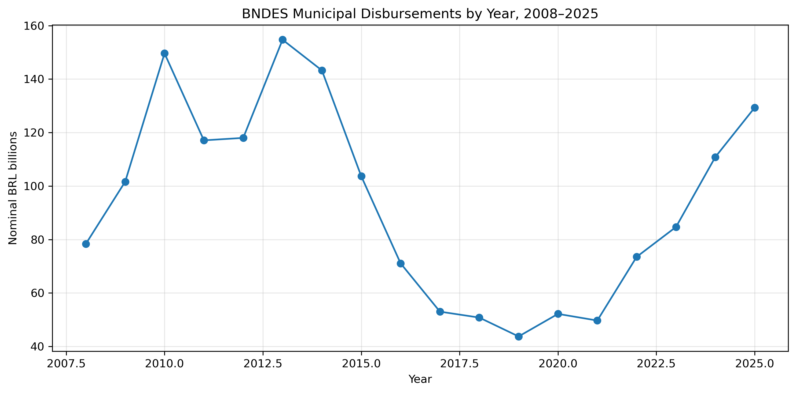
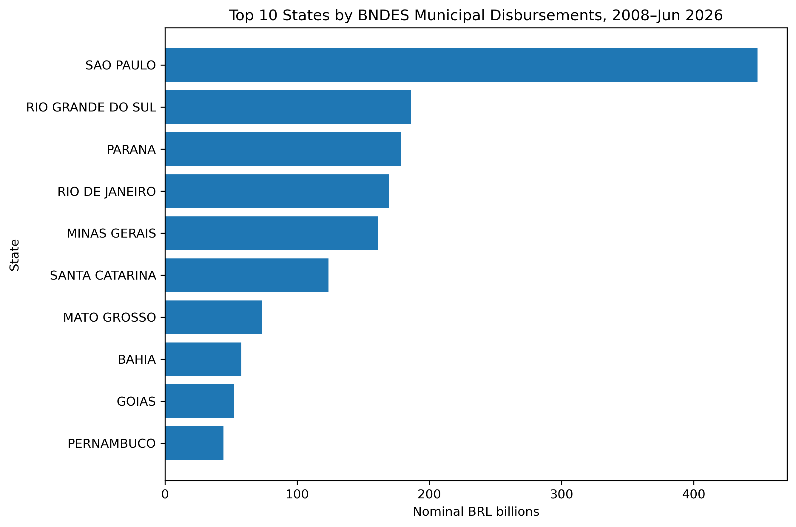
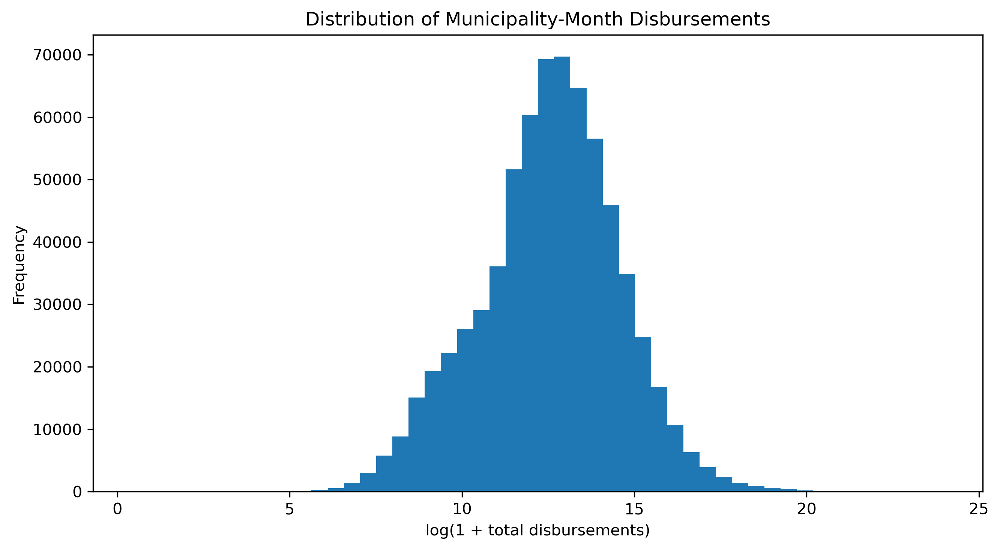

# Brazilian Municipal BNDES Data Analysis

## Data Cleaning, Transformation and Exploratory Analysis with Python

This project demonstrates an end-to-end data analysis workflow using Brazilian municipal-level BNDES financing data.

The objective is to transform a large raw transactional dataset into a clean and validated analytical dataset suitable for municipal-level analysis.

---

## Project Overview

The original dataset contained more than **3.5 million financing records**.

Several data-quality issues were identified during the cleaning process, including:

- mixed data types;
- repeated header rows inside the dataset;
- completely empty observations;
- inconsistent categorical formatting;
- municipality identifiers requiring validation;
- records without a unique municipality identification.

The project demonstrates how these issues can be detected, corrected and validated using Python.

---

## Data Pipeline

```text
3.5M+ raw records
        ↓
Data quality assessment
        ↓
Repeated headers and empty rows removed
        ↓
Data types standardized
        ↓
Categorical variables cleaned
        ↓
Temporal variables created
        ↓
Municipality identifiers validated
        ↓
Non-municipal records separated
        ↓
3.2M+ municipal financing records
        ↓
Municipality-month aggregation
        ↓
689k+ analytical observations
        ↓
Exploratory Data Analysis


Technologies
- Python
- Pandas
- NumPy
- Matplotlib
- Jupyter Notebook


Data Cleaning
The cleaning pipeline includes:
- identification of mixed data types;
- removal of repeated headers;
- removal of completely empty rows;
- standardization of column names;
- conversion of monetary variables;
- standardization of categorical variables;
- construction of month and date variables;
- validation of municipality identifiers;
- verification of duplicated observations.
Financial totals were validated before and after aggregation to ensure that the transformations did not alter the underlying monetary values.

Handling Non-Municipal Records
A special municipality code (9999998) was associated with the label DIVERSOS across multiple Brazilian states.
Because this code does not identify a unique municipality, these records were separated from municipality-level observations.
Approximately 20.84% of total disbursements were classified as DIVERSOS.
These observations were retained separately for financial reconciliation but excluded from the municipality-level dataset.


Analytical Dataset
After cleaning and geographic validation, the municipal data were aggregated at the municipality-month level.
The resulting dataset contains approximately:
- 5,541 municipalities
- 222 monthly periods
- 689,000 municipality-month observations
The analysis covers January 2008 through June 2026.

## Exploratory Data Analysis

###Annual BNDES Municipal Disbursements

Municipal BNDES disbursements show substantial variation over time.
Because monetary values are expressed in nominal Brazilian reais, the observed variation should not be interpreted as real changes without adjusting for inflation.

## Exploratory Data Analysis
```

### Annual BNDES Municipal Disbursements


Municipal BNDES disbursements show substantial variation over time.

Because monetary values are expressed in nominal Brazilian reais, the observed variation should not be interpreted as real changes in credit volume without adjusting for inflation.

### Geographic Concentration



Municipal disbursements are geographically concentrated, with São Paulo representing the largest accumulated value in the analyzed period.

These figures are not adjusted for differences in population, economic size or number of firms across states.

### Distribution of Municipality-Month Disbursements



Disbursement values are strongly right-skewed.

A logarithmic transformation is used to improve visualization of the distribution and reduce the influence of extremely large financing observations.
